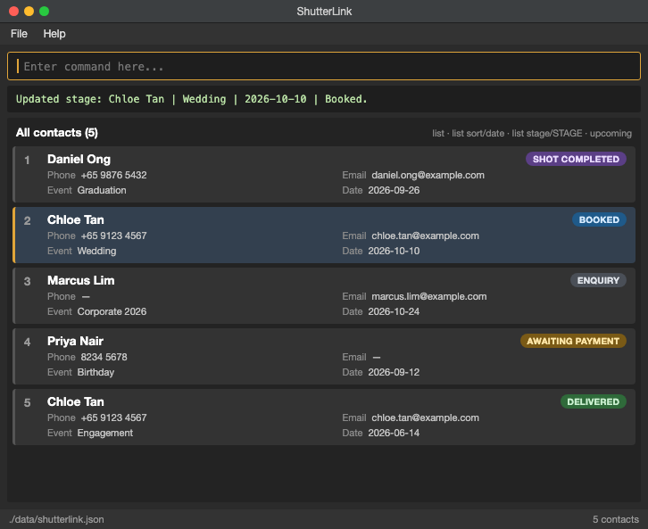

# ShutterLink

ShutterLink is a desktop contact and engagement manager for independent event photographers. It keeps each client connected to their event details and engagement stage, helping photographers manage relationships from the initial enquiry through post-event follow-up.

## Features

- Add client engagements with contact information, event type, and event date.
- Edit contact and event details while preserving the engagement stage.
- Track stages such as `Enquiry`, `Booked`, and `Awaiting Payment`.
- Delete contacts immediately when they are no longer needed.
- Find engagements by exact name, phone number, email address, or event type.
- List all contacts, sort them by event date, or filter them by stage.
- View events taking place within the next seven calendar days.
- Automatically save contacts and restore them when the application starts.
- View supported commands through the in-app help panel.

