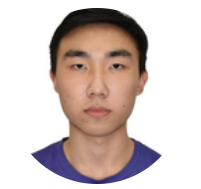
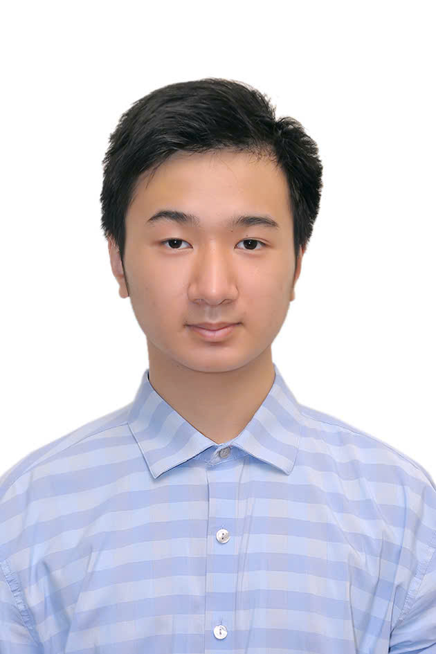
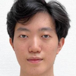

We are a team based in the [School of Computing, National University of Singapore](https://www.comp.nus.edu.sg).

You can reach us at the email `seer[at]comp.nus.edu.sg`

## Project team

### Ruiduan

[[homepage](http://www.comp.nus.edu.sg/~damithch)]
[[github](https://github.com/markadodo)]
[[portfolio](team/johndoe.md)]

* Role: Product engineer

### Jane Doe

[[github](http://github.com/johndoe)]
[[portfolio](team/johndoe.md)]

* Role: Team Lead
* Responsibilities: UI

### Vu Dang Khoa

[[github](https://github.com/ChalasDK22)]

* Role: Developer
* Responsibilities: Data

### Jean Doe

[[github](http://github.com/johndoe)]
[[portfolio](team/johndoe.md)]

* Role: Developer
* Responsibilities: Dev Ops + Threading

### Yu Ke Mi

[[github](https://github.com/yukemii)]

* Role: Developer
* Responsibilities: UI and UX
